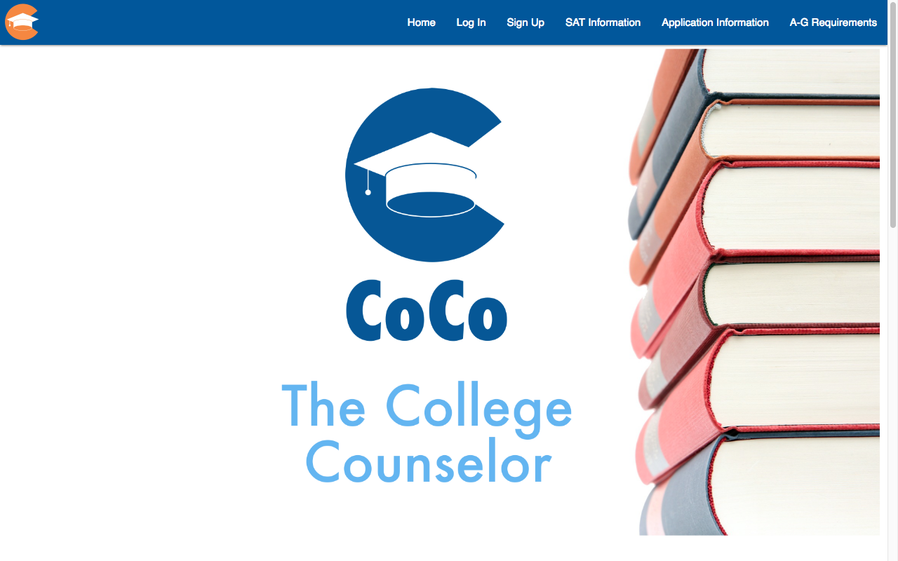
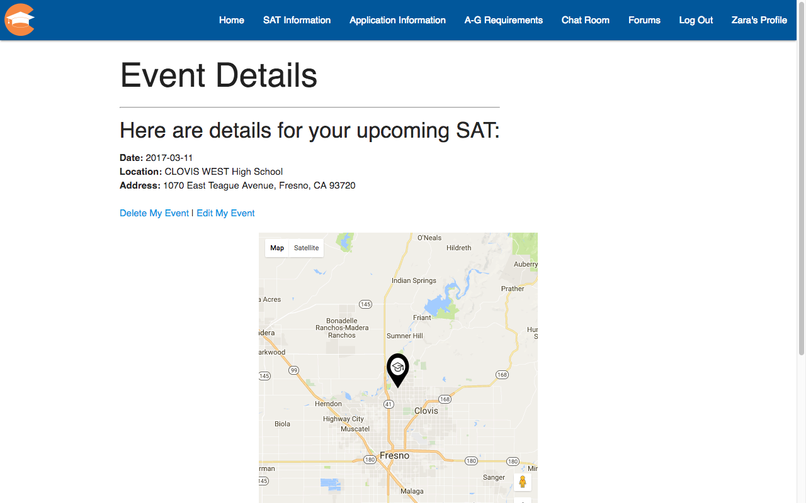
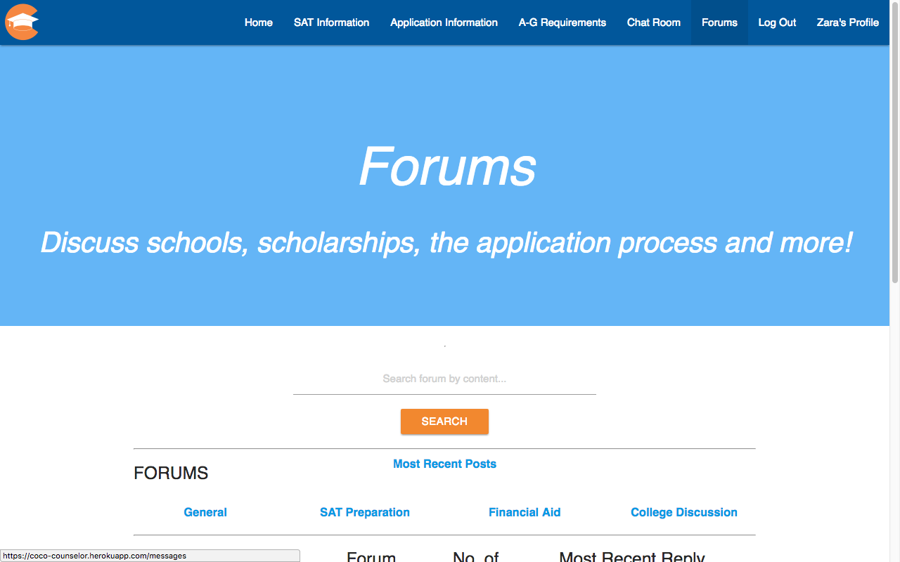

----
## Basic Overview
A personal college counselor web application that keeps students on track and parents informed.

Main features: track A-G course requirements, learn about the college application process including scholarships and fee waivers, receive text notifications and tips about upcoming SAT dates

Tech Stack: Ruby on Rails, JavaScript, Materialize, PostgreSQL, Google Maps API, Twilio API, Active Cable, Heroku, Git


**[Authors](#Authors)**

**[Installation](#installation)**

- [Getting Started](#Getting)

- [Prerequisites](#Prerequisites)

**[Main Features](#Main)**

- [Student Profile Page](#Personalized)


**[Deployment](#Deployment)**

**[Tech Stack](#Built)**

**[License](#license)**

**[Acknowledgments](#Acknowledgments)**

## Getting Started

These instructions will get you a copy of the project up and running on your local machine for development and testing purposes. See deployment for notes on how to deploy the project on a live system.

### Prerequisites

Our project runs on Rails 5 so make sure to have updated versions of Ruby, Javascript and PostgreSQL.


### Installation

Once you have cloned our repo, make sure to:

```
bundle install
```


## Main Features
#### Personalized Student Profile:
[](https://postimg.org/image/j0zfbhbsf/)

This displays a calendar with details about upcoming SAT events as well as college deadlines

#### Directions to Test


#### Forums


## Deployment

Our app is deployed on [Heroku: CoCo](https://coco-counselor.herokuapp.com/).

## Built With

* [Ruby on Rails 5](http://rubyonrails.org/)
* [Javascript](https://www.javascript.com/)
* [PostgreSQL](https://www.postgresql.org/)
* [Google Map API](https://developers.google.com/maps/)
* [Google Translate API](https://cloud.google.com/translate/docs/getting-started)
* [Twilio API](https://www.twilio.com/docs/api?filter-product=sms&filter-platform=mobile)


## Authors
[Zara Aslam](https://github.com/zaslam72)

[Julka Dolgoszyja](https://github.com/yulkalongneck)

[Angelica Gonzalez](https://github.com/agonzalez0515)

[Arlene Perez](https://github.com/Techforchange)

[Rob Turner](https://github.com/georobGWJ)


## License

This project is licensed under the MIT License - see the [LICENSE.md](LICENSE.md) file for details

## Acknowledgments

Thank you to all our mentors for helping us!


forkclone
database
local host
